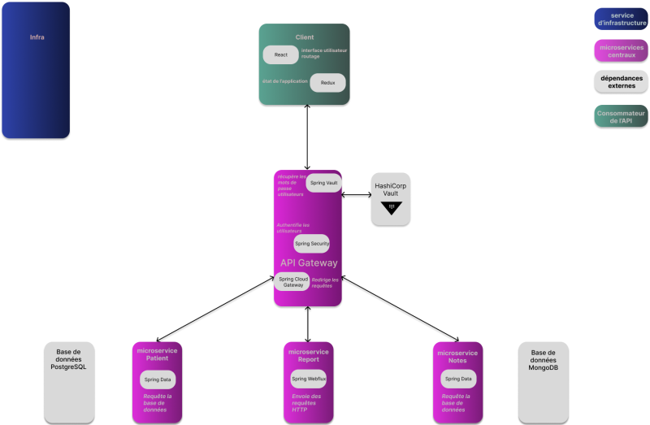

# Microservice Patient

## Architecture

Ce microservice fait partie d'une application de gestion de données médicales et démographiques permettant d'obtenir des rapport de risques en fonction des profils des patients et de constatations médicales. 

Il s'intègre à l'application avec d'autres microservices :
 - [API Gateway](https://github.com/divineion/abernathyclinic-gateway) pour l'authentification et le routage.    
 - [Microservice Notes](https://github.com/divineion/abernathyclinic-notes) pour la gestion des données médicales.  
 - [Microservice Report](https://github.com/divineion/abernathyclinic-report) pour l'évaluation du niveau de risque de diabète en croisant les données démographiques et les notes médicales.   
 - [Infrastructure](https://github.com/divineion/abernathyclinic-infra) pour l'orchestration Docker.   
 - [Interface utilisateur](https://github.com/divineion/abernathyclinic-client) pour l'interface web de gestion des fiches patients et la consultation des rapports de risque.   
 
 

## 1. Rôle
Ce microservice gère les données démographiques des patients (création, modification, consultation).   
Il garantit la conformité de la base de données relationnelle aux normes ISO (3NF). 

## 2. Choix techniques
 - Langage : **Java 24**
 - Framework : **Spring Boot** (Spring Web MVC)
 - Persistance : **PostgreSQL** (schéma normalisé 3NF)
 - Migrations : **Flyway**
 - Conteneurisation : **Docker**

## 3. Configuration
Le service charge sa configuration à partir des variables d'environnement définies dans un fichier `.env`.   
Dupliquez le fichier `.env.example` vers un fichier `.env` et renseignez vos identifiants locaux.


`DATABASE_URL` | URL JDBC PostgreSQL |  `jdbc:postgresql://localhost:5432/abernathyclinic_patient`   
`DATABASE_USERNAME` | identifiant BDD | à renseigner dans le `.env`    
`DATABASE_PASSWORD` | mot de passe BDD | à renseigner dans le `.env`       
`DATABASE_DRIVER` | Driver JDBC | `org.postgresql.Driver`   

## 4. Principaux endpoints

Les interactions entre les microservices utilisent des UUID.   
Toutefois, des endpoints basés sur l'ID séquentiel (/id/{id}) ont été ajoutés dans la perspective d'une transition vers des identifiants plus compacts.   
L'utilisation des préfixes `/id/` et `/uuid/` évite toute ambiguïté de routage.

GET `/api/patients` : récupère la liste de tous les patients (en format minimal DTO).    
GET `/api/patient/id/{id}` : recherche un patient par son ID.    
GET `/api/patient/uuid/{uuid}` : recherche un patient par son UUID.    
GET `/api/patient/{uuid}/report-info` : expose les données nécessaires au service Report.    

POST `/api/patient` : crée un nouveau patient.   

PATCH `/api/patient/{id}` : met à jour partiellement un patient via son ID.   
PATCH `/api/patient/{uuid}/update` : met à jour partiellement un patient via son UUID.   

## 5. Démarrage rapide
### Prérequis
 - Java 24
 - Maven 3.x
 - PostgreSQL installé et démarré
 - [API Gateway](https://github.com/divineion/abernathyclinic-gateway) démarrée pour le routage et l'authentification

### Création de la base de données PostgreSQL
```
CREATE DATABASE abernathyclinic_patient;
```

### Configuration des variables d'environnement
Créez une copie du `.env.example` dans un fichier `.env`.
```
cp .env.example .env
```

Complétez le `.env` créé avec vos identifiants de base de données. 

### Lancer le microservice
```
mvn spring-boot:run -Dspring-boot.run.profiles=dev
```


1. Install PostgreSQL

Install PostgreSQL on your machine (Linux/macOS/Windows).
Make sure the psql command is available.

2. Connect to PostgreSQL and Create the Database
Open a terminal and run:
`psql -U postgres`

Inside the shell:
`CREATE DATABASE abernathyclinic_patient`;

3. Environment Variables
Create a .env file and set your own local values:

`DATABASE_URL=jdbc:postgresql://localhost:5432/abernathyclinic_patient`
`DATABASE_USERNAME=postgres`
`DATABASE_PASSWORD=postgres`
`DATABASE_DRIVER=org.postgresql.Driver`


Replace the default username and password, host, and port if your setup is different.

4. Requirements

Java (17+ recommended)
Maven
PostgreSQL installed and running

5. Run the Microservice
`mvn spring-boot:run`


The microservice will start on port 8081 using your local database.